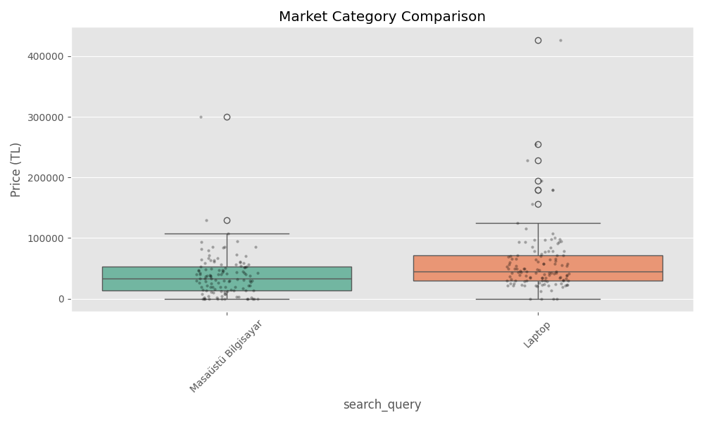
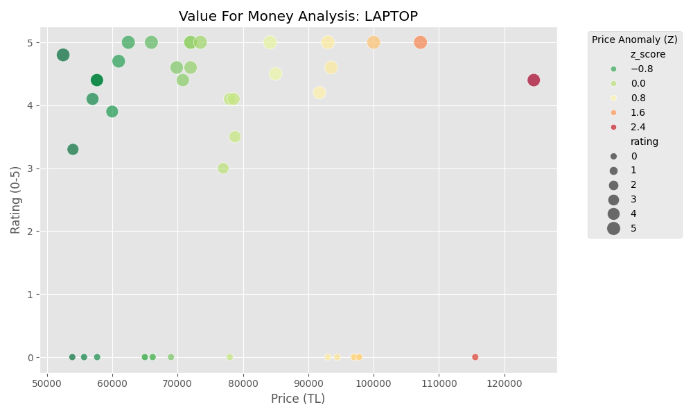
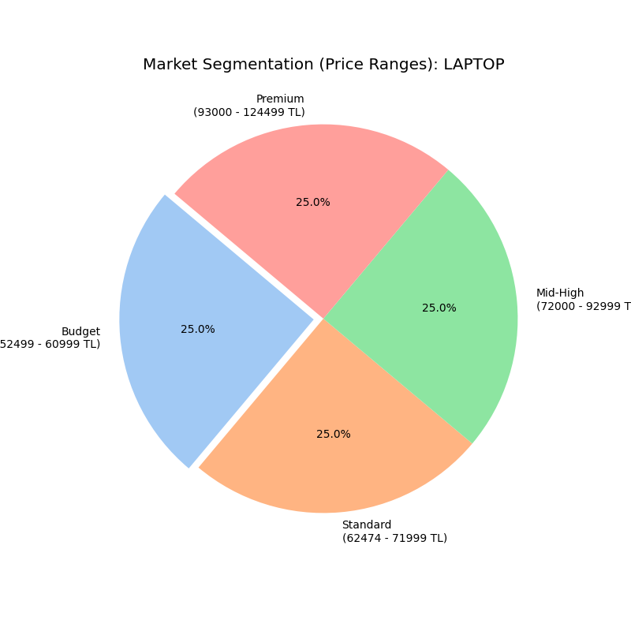
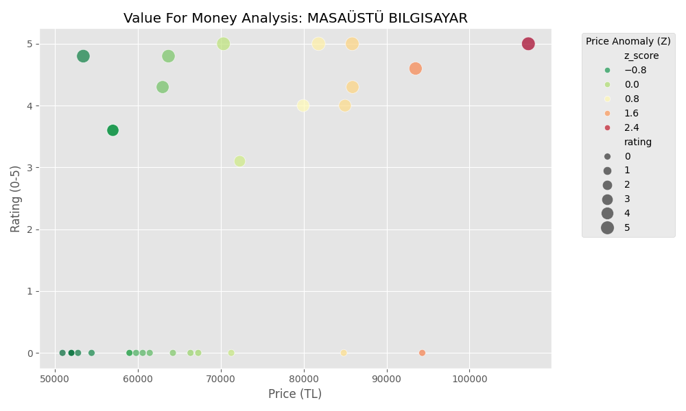
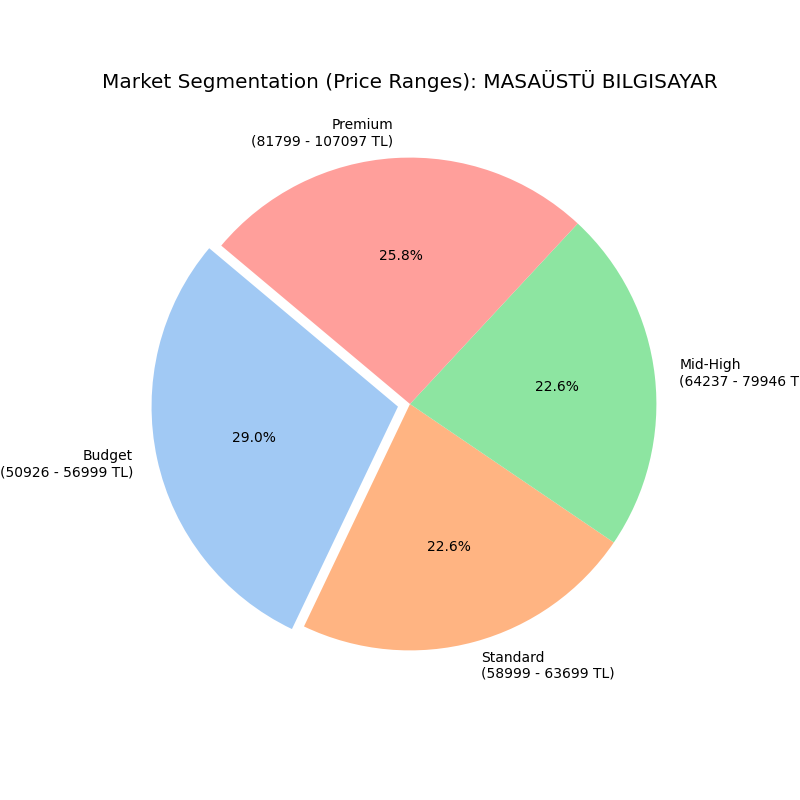

# 🛒 AmzInsights: 

> **Turn raw e-commerce data into actionable market insights using advanced statistical cleaning and professional visualizations.**

---

<div align="center">
  <video src="https://github.com/user-attachments/assets/2f474f77-e0c8-472b-aab0-e71b5794366e" width="100%" autoplay loop muted></video>
</div>

---

---

## 📋 Table of Contents

- [Overview](#overview)
- [Features](#features)
- [Project Structure](#project-structure)
- [Requirements](#requirements)
- [Installation](#installation)
- [Usage](#usage)
- [Dependencies](#dependencies)
- [Notes](#notes)

---

## 🌟 Overview

**AmzInsights** is a robust Python-based market intelligence tool. It bridges the gap between raw web scraping and professional data science by providing a clean GUI to extract, clean, and visualize Amazon product data in real-time.
---

## Features

- 🤖 **Human-Mimicry Automation** — Operates in visible browser mode to replicate authentic user behavior, effectively bypassing advanced anti-scraping measures (like TLS fingerprinting) that typically flag headless bots.
- 🗄️ **Relational Data Persistence** — Integrated `SQLite` engine that automatically stores all scraped data in a local database, ensuring data integrity and allowing for long-term historical analysis.
- 📊 **Data Science Engine** — Leverages `Pandas` for high-performance data cleaning, statistical filtering (IQR-based outlier removal), and summarization.
- 📈 **Advanced Visualizations** — Generates high-fidelity price density plots, Z-Score based value efficiency charts, and market segmentation via `Seaborn` and `Matplotlib`.
- ☁️ **Text Analytics** — Built-in WordCloud engine to identify and visualize trending keywords and market sentiments directly from product descriptions and reviews.
- 📁 **Professional Exporting** — Seamlessly export refined datasets from the SQL database to `.xlsx` (Excel) or `.csv` formats for professional business reporting.
- 🖥️ **Desktop GUI** — A clean, user-centric `Tkinter` interface that bridges the gap between complex backend logic and ease of use for non-technical users.

---

## 📊 Advanced Analytics

Engine provides a multi-layered view of the market by applying statistical filters to the scraped data.

### 🏁 1. Comparative Market Overview

Analyzes price density and distribution across primary categories using **Box-plots combined with Strip-plots**. This visualizes the exact concentration of products in specific price tiers.



---

### 🔍 2. Category Deep Dives

Granular analysis for each search query to isolate the best "Value for Money" opportunities.

#### 💻 Laptop Market Segment

- **Value Analysis:** Identifying "High Value" (low price, high rating) anomalies using Z-Scores.
- **Market Segments:** Categorizing products into Budget, Mid-Range, and Premium tiers.

| Value Analysis (Z-Score) | Market Segments |
| :---: | :---: |
|  |  |

#### 🖥️ Desktop PC Market Segment

- **Value Analysis:** Spotting pricing outliers to prevent overpriced purchases.
- **Market Segments:** Visualizing the volume of products across different pricing categories.

| Value Analysis (Z-Score) | Market Segments |
| :---: | :---: |
|  | 

## Project Structure

```
AmzInsights/
├── main.py                  # Application entry point & service orchestration
├── requirements.txt         # Project dependencies (Pandas, Selenium, Seaborn, etc.)
├── .gitignore               # Excludes database files, logs, and python cache
├── LICENSE                  # MIT License - Official software usage rights
├── README.md                # Comprehensive project documentation
├── assets/                  # High-resolution screenshots and demo video for showcase
├── config/                  # YAML configurations (selectors.yaml, settings.yaml)
├── logs/                    # Runtime logs for debugging and error tracking
├── tests/                   # Test suite (pytest) for logic and integration testing
├── data/                    # Data persistence layer
│   ├── amazon_intelligence.db  # Local SQLite database (Git ignored)
│   ├── exports/             # Final business reports (Excel, JSON)
│   ├── processed/           # Visual analysis outputs (Charts, WordClouds)
│   └── raw/                 # Raw data cache
└── src/                     # Source code root
    ├── core/                # Core logic (Scraper & Workflow Orchestration)
    ├── database/            # Database management and CRUD operations
    ├── gui/                 # User Interface (Tkinter-based application)
    ├── processing/          # Data science (Analysis, Cleaning, Visualization)
    ├── utils/               # Shared utilities (Config parser, Exporters, Loggers)
    └── __init__.py          # Makes the src directory a package

---

## Requirements

- Python **3.9+**
- Google Chrome (must be installed on your system — `undetected-chromedriver` downloads ChromeDriver automatically)
- `pip`

> ⚠️ **Linux users:** `tkinter` may need to be installed separately:
> ```bash
> sudo apt-get install python3-tk
> ```

---

## Installation

### 1. Clone the Repository

```bash
git clone https://github.com/TKarakan/AmzInsights.git
cd AmzInsights
```

### 2. Create a Virtual Environment (Strongly Recommended)

Using a virtual environment (`venv`) keeps your system Python clean, prevents dependency conflicts, and isolates the project from other tools on your machine.

**macOS / Linux:**
```bash
python3 -m venv venv
source venv/bin/activate
```

**Windows:**
```bash
python -m venv venv
venv\Scripts\activate
```

> Once activated, you'll see `(venv)` in your terminal prompt. Remember to activate the virtual environment every time before running the application.

### 3. Install Dependencies

```bash
pip install -r requirements.txt
```

### 4. Run the Application

```bash
python main.py
```

---

## Usage

When launched, a `tkinter` window opens. From the interface:

1. Enter the product keyword you want to search
2. Configure scraping parameters (number of pages, sorting, etc.)
3. Click **Start** — the scraper begins running
4. Results are displayed in a table with charts and graphs
5. Use the export button to save data as `.xlsx`

---

## Dependencies

| Package | Version | Purpose |
|---------|---------|---------|
| `undetected-chromedriver` | ≥ 3.5.0 | Bot-detection-bypassing Chrome automation |
| `selenium` | ≥ 4.9.0 | Web browser control |
| `pandas` | ≥ 2.0.0 | Data processing and analysis |
| `matplotlib` | ≥ 3.7.0 | Charts and visualization |
| `seaborn` | ≥ 0.12.0 | Statistical visualization |
| `wordcloud` | ≥ 1.9.0 | Word cloud generation |
| `openpyxl` | ≥ 3.1.0 | Excel (.xlsx) export |

> `tkinter` ships with Python's standard library and is not listed in `requirements.txt`.

---

## Notes

- Amazon's page structure may change over time — CSS selectors may need to be updated accordingly.
- Heavy usage can trigger IP-based rate limiting; it is recommended to use reasonable delays between requests.
- This tool is intended for educational and personal research purposes only. Please review Amazon's [Conditions of Use](https://www.amazon.com/gp/help/customer/display.html?nodeId=508088) before use.

---

## Deactivating the Virtual Environment

When you're done:

```bash
deactivate
```

---

*AmzInsights — Explore the market, intelligently.*
